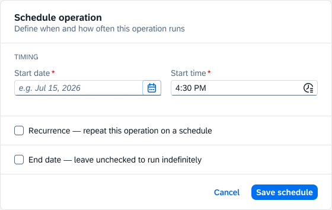
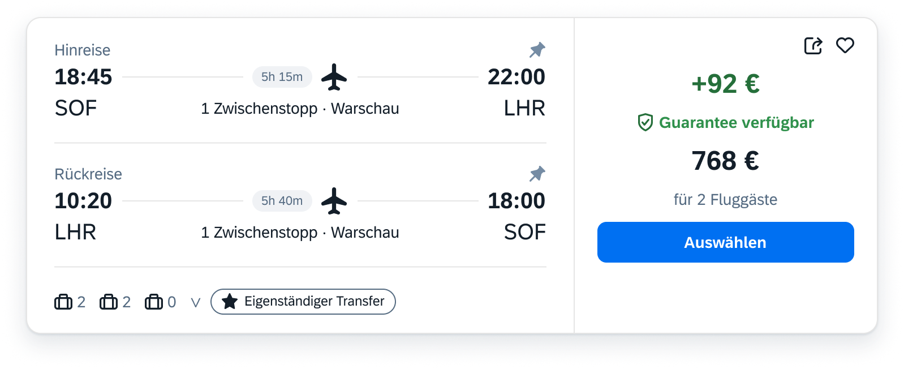
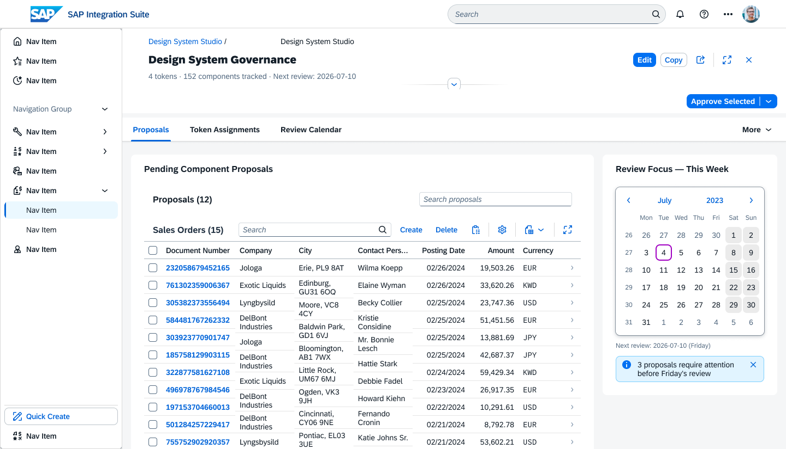

# Claude to Figma SAP Application

> Describe a business screen in plain language — or attach a sketch, screenshot, or Figma reference. Claude reads official SAP guidelines, measures the reference, selects components, previews the layout as an ASCII wireframe for your approval, then builds a real SAP Fiori screen directly in Figma — real library components, live tokens, zero manual drag-and-drop. **ANALYZE → PLAN → EXECUTE → VALIDATE → LEARN.**


---

## Examples — screens built by the system

| Schedule Operation Dialog | Flight Result Card | Design System Governance |
|:---:|:---:|:---:|
|  |  |  |
| Complex dialog · timing · recurrence · monthly pattern · end date | Custom card layout · flight legs · price zone · action CTA | FCL layout · SideNav · nested table · review calendar |

All screens built from a plain-language description or reference image — real SAP components, live Horizon tokens, verified layer structure.

---

## Installation

### What you get

| What | Purpose |
|------|---------|
| 5 MCP servers (auto-configured) | Claude's connection to Figma, SAP guidelines, and reference analysis |
| 152-component registry | Every SAP UI component with properties, tokens, and usage rules |
| 154 Fiori guideline files | SAP design guidelines cached locally — no internet needed per build |
| Figma plugin | Binds real SAP design tokens after Claude builds the screen structure |
| 8 canonical SAP screens | Confirmed reference screens Claude clones from as a quality baseline |

---

### Step 1 — Clone and run the installer

```bash
git clone https://github.com/Venelinhr/Claude-To-Figma-SAP-Application.git
cd Claude-To-Figma-SAP-Application
./install.sh
```

The installer handles everything automatically: installs dependencies, registers all 5 MCP servers in Claude Code, and copies the skill files.

**You need:** Node.js ≥ 20 · [Claude Code CLI](https://claude.ai/code) · Figma desktop app

---

### Step 2 — Add your Figma API token

**Why you need it:** Claude communicates with Figma through the Figma API — it reads your existing screens, inspects component structure, and writes new screens directly to your canvas. The API token is how Figma knows the request is coming from you and has permission to access your files. Without it, Claude cannot read from or build into Figma at all.

The installer adds a placeholder automatically. Replace it with your real token:

1. Go to **figma.com → Settings → Personal access tokens** → generate a new token
2. Open `~/.claude/settings.json` and find this line:
   ```
   "FIGMA_API_TOKEN": "YOUR_FIGMA_TOKEN_HERE"
   ```
3. Replace `YOUR_FIGMA_TOKEN_HERE` with your token

> **Internal SAP users:** if your organisation uses SSO or a managed Figma account, generate the token the same way — personal access tokens work regardless of how your account is administered. Keep the token private; treat it like a password.

---

### Step 3 — Load the Figma plugin

The plugin is what connects Claude's output to real SAP design tokens. Claude builds the screen structure — the plugin then binds the official SAP colours, spacing, and typography from your SAP library.

1. Open **Figma desktop**
2. Go to **Plugins → Development → Import plugin from manifest...**
3. Select `plugin/figma-builder/manifest.json` from this repo

The plugin appears under **Plugins → Development → SAP Figma Builder** and runs inside any Figma file.

---

### Step 4 — Connect the SAP Web UI Kit in Figma

This is the official SAP component library. Claude pulls components from it for every build — buttons, tables, headers, status indicators, icons, and the full SAP token system.

**External users (one-time setup):**

1. Open [SAP Web UI Kit on Figma Community](https://www.figma.com/community/file/1494295794601744471) and click **Duplicate to your drafts** (free)
2. Open your duplicated copy in Figma desktop
3. In the file: click the file name at the top → **Publish styles and components** → Publish
4. In your working Figma file: open the **Assets panel** (left sidebar) → click the **Libraries** icon → find **SAP Web UI Kit** → toggle **ON**

**Internal SAP users:**

If you work at SAP and use the company Figma organisation, the SAP Web UI Kit is likely already available as a shared library — you do not need to duplicate it.

1. In your Figma file: open the **Assets panel** → click the **Libraries** icon
2. Look for **SAP Web UI Kit** under your organisation's shared libraries → toggle **ON**
3. If it is not listed, ask your Figma admin or check the SAP Design internal resources — do not duplicate the community copy on top of the organisation version, as this creates two competing libraries

> **If component imports fail** — the SAP Web UI Kit library is not enabled in the current file, or the wrong version is active (organisation vs. community duplicate). Check the Libraries panel and make sure only one version is toggled on.

---

### Step 5 — Open the canonical screen file

The repo includes `docs/canonical-screens/Claude to Figma SAP Application.fig` — 8 approved SAP screens that serve as the quality baseline. Claude clones from these instead of building from scratch.

1. In Figma: **File → Open from computer** → select the `.fig` file from the repo
2. Enable the SAP Web UI Kit library in this file too (same as Step 4)

---

### Step 6 — Restart Claude Code and verify

```bash
claude mcp list   # should show 5+ servers including "figma"
```

---

### You're ready

Open Claude Code in this project folder and describe what you want to build:

> *"Build a Purchase Orders approval screen"*
> *"Create a mobile list view for field service tasks"*
> *"Design an Object Page for a supplier profile"*

Attach a screenshot or wireframe as reference if you have one. Claude analyses it, shows you an ASCII wireframe for approval, then builds the screen directly in Figma. Select the frame, run **Bind SAP Tokens** in the plugin — done.

---


## How It Works — the full pipeline

```
You: "Build a Purchase Orders approval screen"
           │
           ▼
  ┌─────────────────────────────────────────────────┐
  │  ANALYZE                                        │
  │  • Measure reference width (default 1440px)     │
  │  • Sector-by-sector visual reading (A→B→C)      │
  │  • Floorplan scored + confirmed with you        │
  │  • VDI: 7 artifacts, confidence tiers ●○?       │
  └────────────────────┬────────────────────────────┘
                       │
                       ▼
  ┌─────────────────────────────────────────────────┐
  │  PLAN                                           │
  │  • ASCII wireframe — every region, every        │
  │    component. You approve before any build.     │
  │  • L1–L5 layer structure proposed               │
  │  • Clone source selected from canonical .fig    │
  └────────────────────┬────────────────────────────┘
                       │ "approved" ◄─── iterate here (free, instant)
                       ▼
  ┌─────────────────────────────────────────────────┐
  │  EXECUTE  (one use_figma call)                  │
  │  • Parallel import all SAP components           │
  │  • Clone canonical → clear slot → repopulate   │
  │  • Name-tag fills [sapToken] · text [typo:role] │
  │  • Real SAP instances only — never createFrame()│
  └────────────────────┬────────────────────────────┘
                       │
                       ▼
  ┌─────────────────────────────────────────────────┐
  │  VALIDATE  (one screenshot)                     │
  │  • Compare vs reference                         │
  │  • You click "Bind SAP Tokens" in the plugin    │
  │    → live SAP Horizon variables bound           │
  │    → 4 §7 a11y validators run automatically     │
  └────────────────────┬────────────────────────────┘
                       │
                       ▼
  ┌─────────────────────────────────────────────────┐
  │  LEARN                                          │
  │  • "bravo / perfect" → canonical saved          │
  │  • "not right / fix this" → lesson captured     │
  │  • Next similar build recalls the right lesson  │
  └─────────────────────────────────────────────────┘
                       │
                       └──────────────────────────────┐
                                                       │ loops back
                                                       ▼
                                             ANALYZE (next build)
                                        lesson already recalled,
                                        canonical clone ready
```

**Yes, it loops.** LEARN feeds directly into the next ANALYZE:
- The matching lesson surfaces automatically before Claude starts — right pattern, right components, confirmed token values
- Claude clones from the verified canonical screen, not from scratch
- Each confirmed build raises the floor for the next — you never debug the same problem twice

**Nothing gets generated until you say "approved".**
Refinements happen on the ASCII wireframe — free and instant — not after the plugin already built the screen.

---

## Example — what Claude shows you at the PLAN stage

After analysis, Claude presents an ASCII wireframe + component breakdown for your approval **before writing a single line of Figma code.**

```
┌─────────────────────────────────────────────────────────────────┐
│  ShellBar                                                       │
│  [≡]  Purchase Orders          [Search]  [?]  [👤 User ▾]      │
├─────────────────────────────────────────────────────────────────┤
│  DynamicPageTitle                                               │
│  Purchase Orders (142)          [Approve]  [Reject]  [Export ▾] │
├─────────────────────────────────────────────────────────────────┤
│  FilterBar                                                       │
│  [Supplier ▾]  [Status ▾]  [Date range ▾]  [Go]  [Adapt]       │
├─────────────────────────────────────────────────────────────────┤
│  Responsive Table                                               │
│  ☐  │ PO Number  │ Supplier        │ Amount       │ Status      │
│─────┼────────────┼─────────────────┼──────────────┼────────────│
│  ☐  │ 4500012891 │ Acme Corp       │ € 24,500.00  │ ● Pending  │
│  ☐  │ 4500012892 │ GlobalX GmbH    │ € 8,200.00   │ ● Pending  │
│  ☐  │ 4500012893 │ FastLog Ltd     │ € 61,750.00  │ ✔ Approved │
│  ☐  │ 4500012894 │ NordSupply AG   │ € 3,400.00   │ ✘ Rejected │
├─────────────────────────────────────────────────────────────────┤
│  Pagination   [◀]  1 of 12  [▶]                                 │
└─────────────────────────────────────────────────────────────────┘
```

**Components Claude will use to build this screen:**

| Region | SAP Component | Why |
|--------|--------------|-----|
| App shell | `ShellBar` | Top-level navigation, branding, user menu |
| Page title + actions | `DynamicPageTitle` | Title with item count + primary action buttons |
| Filter row | `FilterBar` | Standard SAP filter pattern with Go + Adapt |
| Data | `ResponsiveTable` with `MultiSelectMode` | Best for tabular list data with bulk actions |
| Status column | `ObjectStatus` (`Semantic=Warning/Success/Error`) | Semantic color + icon, theme-switchable token |
| Amount column | `ObjectNumber` | Right-aligned number with currency, SAP typography |
| Row actions | `Button` (Accept / Reject) | Type=Accept / Type=Reject — correct SAP affordance |
| Pagination | `PaginationBar` | Standard SAP paging pattern |

**L1–L5 layer structure:**
```
Purchase Orders
├── Shell Bar                            L2  SAP ShellBar
├── Page Header                          L2  region
│   └── Dynamic Page Title               L3  SAP DynamicPageTitle
│       └── Primary Actions              L4  group
│           ├── Approve Button           L5  SAP Button · Type=Accept
│           ├── Reject Button            L5  SAP Button · Type=Reject
│           └── Export Button            L5  SAP Button · Type=Secondary
├── Filters                              L2  region
│   └── Filter Bar                       L3  SAP FilterBar
│       ├── Supplier Filter              L4  SAP FilterGroupItem
│       ├── Status Filter                L4  SAP FilterGroupItem
│       └── Date Range Filter            L4  SAP FilterGroupItem
├── Main Content                         L2  region
│   └── Responsive Table                 L3  SAP ResponsiveTable
│       ├── PO Number Column             L4  column
│       ├── Supplier Column              L4  column
│       ├── Amount Column                L4  column · SAP ObjectNumber
│       ├── Status Column                L4  column · SAP ObjectStatus
│       └── Row 1                        L4  data row
│           ├── PO Number                L5  text cell
│           ├── Supplier Name            L5  text cell
│           ├── Amount                   L5  SAP ObjectNumber
│           └── Status                   L5  SAP ObjectStatus
└── Footer                               L2  region
    └── Pagination Bar                   L3  SAP PaginationBar
```

You can iterate on any part — change the floorplan, add a column, switch to mobile — before Claude builds anything.

---

## ANALYZE → PLAN → EXECUTE → VALIDATE → LEARN

The methodology behind every build. 14 consecutive failed iterations traced to one root cause: building without analysis first.

| Stage | What happens | Key rule |
|---|---|---|
| **ANALYZE** | `get_design_context` on nearest canonical node · sector-by-sector visual reading · measure reference width · floorplan scored | Never skip |
| **PLAN** | Map content to slot structure · list property keys · identify clone source · propose L1–L5 layer tree | Before any code |
| **EXECUTE** | Single `use_figma` call · Clone-Clear-Repopulate · parallel imports · real SAP instances only | One shot |
| **VALIDATE** | One screenshot · compare vs reference · plugin binds tokens · 4 a11y validators | One shot |
| **LEARN** | Approval → save canonical · correction → capture lesson · next build recalls matching lesson | Every build |

### 3 Hard Build Rules
1. **Real SAP instances only** — every UI element is a real SAP Web UI Kit component. Never a plain frame.
2. **L1–L5 semantic naming** — No `Frame 1`, no `(SAP)` suffix, no redundant nesting. Layers readable without opening any node.
3. **No Spacer frames** — spacing via Auto Layout only (`itemSpacing`, `SPACE_BETWEEN`, `layoutGrow`).

---

## 30 Mandatory Rules

Every build is governed by these rules. Violating any stops generation.

<details>
<summary><strong>RULE 1 · HARD GATE</strong> — Registry gate: every component must exist in the registry</summary>

Before any build, every component in the plan must have a matching file in `knowledge/components/registry/`. If a component is missing, the build stops — no exceptions. This prevents invented or hallucinated components from reaching Figma.

</details>

<details>
<summary><strong>RULE 2 · HARD GATE</strong> — Token whitelist: every colour must be one of the 80 mandatory SAP tokens</summary>

No raw hex colours are allowed anywhere in a build. Every fill must be one of the 80 tokens in `MANDATORY_TOKENS`. Raw hex = rejected by the plugin. This enforces theme-switchability and audit compliance.

</details>

<details>
<summary><strong>RULE 3 · STOP</strong> — Floorplan confirmation is mandatory before proceeding</summary>

Claude proposes a floorplan (List Report, Object Page, Worklist, etc.) and must wait for your confirmation before doing anything else. The wrong floorplan wastes all downstream work.

</details>

<details>
<summary><strong>RULE 4</strong> — Only set non-default properties</summary>

Don't set component properties that are already at their default value. It makes builds noisy and harder to read. Only write what actually needs to change.

</details>

<details>
<summary><strong>RULE 5</strong> — No raw pixel values or hardcoded font sizes</summary>

Every size, spacing, and typography value must come from SAP Horizon tokens or design system steps — never hardcoded numbers. Hardcoded values break when the theme changes.

</details>

<details>
<summary><strong>RULE 6</strong> — No invented component names or properties</summary>

All component names, variant names, and property keys must come from the live SAP Web UI Kit. Never guess or invent them. Use the registry or `search_design_system` to verify.

</details>

<details>
<summary><strong>RULE 7</strong> — Measure the reference width before building (default 1440px)</summary>

Read the pixel width of any reference image before planning the layout. Default to 1440px if no reference. Snap-suggest standard breakpoints (375 mobile / 768 tablet / 1440 desktop) when close. A user-specified width always wins.

</details>

<details>
<summary><strong>RULE 8</strong> — Rendering conventions: Auto Layout, no absolute positioning</summary>

All layouts use Figma Auto Layout. No absolute-positioned frames except where the SAP kit explicitly requires it (e.g. overflow icon buttons beside DPH). No empty spacer frames.

</details>

<details>
<summary><strong>RULE 9</strong> — Density must match the use case (Cozy vs Compact)</summary>

Choose the correct SAP density for the screen type. Compact for data-heavy desktop screens. Cozy for touch / mobile / action-oriented screens. Never mix densities within a screen.

</details>

<details>
<summary><strong>RULE 10</strong> — Responsive breakpoints must be planned</summary>

Every screen plan must state its target breakpoint and note how it responds at other sizes. A desktop screen that has never considered mobile is incomplete.

</details>

<details>
<summary><strong>RULE 11</strong> — Incremental edit: change the minimum needed</summary>

When updating an existing screen, change only what was asked. Don't reorganise, rename, or "improve" untouched areas. Scope changes tightly to avoid regressions.

</details>

<details>
<summary><strong>RULE 12</strong> — Reference-First: a reference is business intent, not a pixel template</summary>

A reference image or Figma URL tells you what the business needs. It does not dictate exact pixel layout. Adapt to SAP floorplan conventions — never copy reference visuals literally.

</details>

<details>
<summary><strong>RULE 13</strong> — Adopt-working-pattern: if a proven pattern exists, use it</summary>

If a confirmed working pattern exists in memory or the canonical screens (e.g. Progress Row, DPH clone method), use it exactly. Don't redesign what's already been solved and confirmed.

</details>

<details>
<summary><strong>RULE 14</strong> — Container-First: build the container before filling children</summary>

Always create and configure the outer frame/container first, then append children. Building children before their parent causes sizing and Auto Layout failures.

</details>

<details>
<summary><strong>RULE 15</strong> — Positive feedback = canonical: freeze it, don't improve it</summary>

When you confirm a result is correct ("perfect", "bravo", "exactly"), that result becomes the canonical reference for similar future builds. Never silently revert or "improve" a confirmed result.

</details>

<details>
<summary><strong>RULE 16</strong> — Post-build learning: capture exact measurements after confirmation</summary>

After a confirmed quality build, record exact token values, padding, gap, and font roles into `knowledge/guidelines/token-assignment-rules.md`. This is how confirmed knowledge becomes permanent.

</details>

<details>
<summary><strong>RULE 17</strong> — Divide-and-conquer: never analyse a reference as one flat image</summary>

Split every reference into labelled sectors (A, B, C…). Analyse each sector fully before moving to the next. Merge the sector analyses into the overall plan. This prevents missed elements and wrong component choices. See `skill/sap-visual-reading/sector-analysis.md`.

</details>

<details>
<summary><strong>RULE 18</strong> — Spatial reconstruction: measure first, never assume dimensions</summary>

Before placing any element, measure or infer its size from the reference. Never use arbitrary numbers. Every dimension should be traceable to a reference measurement or an SAP spacing token.

</details>

<details>
<summary><strong>RULE 19 · HARD GATE</strong> — ASCII wireframe before build — you must approve it</summary>

Before any `use_figma` call, Claude shows an ASCII wireframe of the full screen and stops. You must explicitly approve it before the build starts. This gate exists even when the analysis is cached. Violated twice on 2026-07-14 — never again.

</details>

<details>
<summary><strong>RULE 20 · MANDATORY</strong> — Reasoning Brain: produce structured artifacts before designing the component hierarchy</summary>

Before selecting components, Claude must produce: business intent, persona, task, data, actions, states, constraints, context, interaction model, floorplan scoring. These 7 artifacts are the evidence base for every downstream decision.

</details>

<details>
<summary><strong>RULE 21 · MANDATORY</strong> — QA Certification: Zero-Defect + self-repair before handoff</summary>

Before reporting a build complete, Claude runs its own QA pass: 0 raw hex fills, 0 hardcoded fonts, 0 `Frame N` layer names, 0 Spacer frames, all SAP instances. If any fail, self-repair before handing off.

</details>

<details>
<summary><strong>RULE 22</strong> — Never use a component for a purpose it wasn't designed for</summary>

Don't repurpose SAP components outside their intended role (e.g. using a MessageStrip as a status badge). If no exact match exists, use the closest correct component and document the deviation.

</details>

<details>
<summary><strong>RULE 23 · SOURCE OF TRUTH</strong> — SAP Web UI Kit is the only source for components, tokens, and icons</summary>

Every component, every token, every icon must come from the SAP Web UI Kit (file `SILcWzK5uFghKun9jx6D7c`). No invented components. No non-SAP icon sets. No custom tokens. This is non-negotiable.

</details>

<details>
<summary><strong>RULE 24 · MANDATORY</strong> — Live kit resolution: read component properties from the live kit, not from memory</summary>

Variant property names and options must be verified against the live kit — not assumed from UI5 vocabulary. Example: `ObjectStatus` uses `Semantic` not `State`. `Button` `Type` has no `Emphasized` or `Transparent` options.

</details>

<details>
<summary><strong>RULE 25 · DEFAULT</strong> — MCP-First: build via use_figma with real SAP instances and name tags</summary>

The default build path is `use_figma` with real SAP kit instances imported via `importComponentSetByKeyAsync`. Every fill tagged `[sapToken]`, every text tagged `[typo:role]`, every icon placeholder `◆ICON/name`. Root frame named `◆SAP-UNBOUND/ScreenName`. The plugin binds tokens after.

</details>

<details>
<summary><strong>RULE 26 · MANDATORY</strong> — Visual Design Intelligence: run the full sap-visual-reading analysis on every reference</summary>

Any reference image or Figma URL triggers the full 8-stage VDI analysis (or loads the SHA-1 semantic-model cache for a 96% token saving). This produces the 12-part structured output that grounds every build decision. Never skip it.

</details>

<details>
<summary><strong>RULE 27</strong> — Confirmation triggers ground-truth capture</summary>

When you confirm a result is correct, the `ground-truth-updater` agent writes exact measurements (padding, gap, font role, token) into `knowledge/guidelines/token-assignment-rules.md`. This closes the learning loop and seeds future builds.

</details>

<details>
<summary><strong>RULE 28</strong> — Build reads SAP_BUILD_MANIFEST.md only — never code.js — one-shot build, ≤1 screenshot</summary>

The build agent reads exactly one file: `SAP_BUILD_MANIFEST.md` (~2k tokens). It never reads `code.js` (45k tokens — blocked by hook), never bulk-loads registry JSONs. One `use_figma` call. One verification screenshot. If wrong after one corrective re-run, stop and escalate.

</details>

<details>
<summary><strong>RULE 29</strong> — Visual Recovery Protocol: when lost or wrong, stop and read the canonical reference</summary>

If output is wrong or guessing is happening: STOP. Open `docs/canonical-screens/Claude to Figma SAP Application.fig`. Call `get_design_context` on the closest canonical node. Extract ground truth. Build once from that. Never retry blindly.

</details>

<details>
<summary><strong>RULE 30</strong> — Measure the reference width first; default 1440px; snap-suggest standard breakpoints</summary>

At the start of every analysis, measure or confirm the reference pixel width. Default 1440px for desktop. When close to 375/768/1440, suggest the standard breakpoint. The user's explicit width instruction always overrides any suggestion.

</details>

---

## Three-Layer Architecture

Each layer does only what it uniquely can:

```
┌────────────────────────────────────────────────────────────────┐
│  Layer 1 — Claude (Reasoning)                                  │
│  Reads references · runs 30 rules · visual analysis            │
│  Selects floorplan + components · builds via Figma MCP         │
│  QA + self-repair · captures lessons                           │
└───────────────────────────┬────────────────────────────────────┘
                            │ builds screen (one call)
                            ▼
┌────────────────────────────────────────────────────────────────┐
│  Layer 2 — Figma MCP (Execution)                               │
│  Inserts real SAP kit instances                                │
│  Sets variant properties · marks fills and text for binding    │
└───────────────────────────┬────────────────────────────────────┘
                            │ you click "Bind SAP Tokens"
                            ▼
┌────────────────────────────────────────────────────────────────┐
│  Layer 3 — Plugin (Token Bridge)                               │
│  The only piece with access to SAP library variables           │
│  Binds real SAP Horizon tokens (theme-switchable)              │
│  Swaps icon placeholders · binds text styles                   │
│  Runs 4 accessibility validators automatically                 │
└────────────────────────────────────────────────────────────────┘
```

> **Why three layers?** The Figma MCP runs in a sandbox — it can read and write structure, but it cannot access your SAP library's private token variables. Only a real Figma plugin can do that. So Claude builds the structure, the plugin binds the tokens. Each does the one thing only it can do.

---

## Inputs Claude Accepts

| Input | What happens |
|---|---|
| **Text** — user story, Jira ticket, description | Stage 3: extracts persona · task · data · actions · states |
| **Reference image** — screenshot, wireframe, sketch | VDI 7-artifact analysis + sector-by-sector reading (A→B→C). Quality tier assessed first. |
| **Figma URL** — `?node-id=355-39080` | `get_design_context` → exact measurements, the ● confirmed source |
| **Document** — PDF spec, markdown, requirements list | Parsed at Stage 3, merged with Stage 4 |

Image + text → both run, merged. Image only → Stage 2. Text only → Stage 3.

---

## Token Optimization — ~25k → ~3k per build (~88% reduction)

| Cost source | Before | After | How |
|---|---|---|---|
| Reading `code.js` | ~45k tokens | **0** | Hook blocks read · manifest has all keys |
| VDI reference bundle | ~8k/build | ~2k | Consolidated `VDI_REFERENCE.md` (−76%) |
| VDI analysis (repeat image) | ~13.5k | ~0.7k | SHA-1 cache in `semantic-models/` (−96%) |
| Build knowledge | ~15–20k | ~2k | Single `SAP_BUILD_MANIFEST.md` |
| Live iteration loop | 8 calls + 6 shots | 1 call + 1 shot | Analyze before executing |
| Sequential imports | ~2.1s | ~0.5s | `Promise.all` — 3–4× faster |

---

## The Loop — Learning · Improving · Better Ecosystem

The system gets smarter with every session.

```
User: "bravo" / "not perfect" / "close but…" / "great but you broke X"
  │
  ▼ feedback-learn.sh (UserPromptSubmit hook — fires automatically)
  │   • negation guard  ("not perfect" → correction, not praise)
  │   • hedged detection  ("close but", "not quite", "isn't what I meant")
  │   • mixed handling  (praise + correction → one row, asked to disambiguate)
  │   • word-boundaries  ("bad" ≠ "badge", "broke" ≠ "brokerage")
  │
  ▼ writes durable entry → .claude/pending-learnings.jsonl  (survives session)
  │
  ▼ verify-learnings.sh (Stop hook) — re-reminds at turn end if uncaptured
  │
  ▼ surface-learnings.sh (SessionStart) — resurfaces across sessions
  │
  ▼ recall-lessons.sh (UserPromptSubmit) — surfaces the MATCHING lesson
      "build a SideNav" → pulls the SideNav lesson, not all 60 flat
      "purchase order"  → pulls the PO canonical, not generic list-report
```

**Four self-improving loops run automatically:**

**A · Quality on every edit**
Every time a component definition is updated, the plugin bundle rebuilds automatically. No manual step — the change is live immediately.

**B · Quality on every build**
When a session ends, the system checks whether the last screen was left unbound (structure built but tokens not yet applied). If so, it reminds you before the session closes. Manifest drift is also caught automatically.

**C · Learning from feedback**
Every time you react to a result — approval, correction, or "close but not quite" — the signal is detected, classified, and saved to a persistent log that survives session restarts. The next time you build something similar, the relevant lesson surfaces automatically at the start of the conversation. You don't need to remember what worked last time.

**D · Locking in quality results**
When you confirm a screen is exactly right, the system flags it for ground-truth capture — exact measurements, tokens, and patterns are written into the knowledge base so future builds can clone from a verified baseline rather than re-discovering the same answers.

---

## Canonical Reference Screens

**Included in this repo:** `docs/canonical-screens/Claude to Figma SAP Application.fig`

This is the quality baseline for every build. It contains 8 real, approved SAP Fiori screens — not mockups, not examples, but pixel-accurate screens with live SAP components, correct tokens, and verified layer structure.

**Claude uses this file automatically.** Before building any screen, Claude checks this file for the closest matching reference, reads its exact structure, and clones from it. You never start from scratch.

**You can open it too.** Open the `.fig` file in Figma any time to inspect how a screen was built — what components were used, how layers are named, which tokens are applied. It's the clearest answer to "what should this look like?" for any SAP Fiori pattern.

| Screen in the file | Pattern |
|--------------------|---------|
| Design System Governance Console | FCL layout · SideNav · nested tables |
| Side Navigation | Full 20-item tree · expandable groups · active state |
| Schedule Operation | Dialog form · date/time fields · 4 variants |
| Activities View | List Report · Progress Rows · Filter Bar |
| Purchase Orders | List Report · approval actions · ObjectStatus |
| Validate System | Log panel · severity pills · SegmentedButton filter |
| Outage List Overview | Desktop List Report · 8 columns · status indicators |
| yanatest Steps | Object Page narrow · DPH · IconTabBar |

No private Figma access needed — the file ships with the repo and works offline.

| Screen | Confirmed |
|---|---|
| Design System Governance Console (FCL + SideNav + Table) | ✅ |
| Side Navigation (full tree, 20 items) | ✅ |
| Schedule Operation — Daily / Monthly / Monthly+End / Base | ✅ |
| Activities View (List Report + Progress Rows) | ✅ "Perfect" |
| Purchase Orders List Report | ✅ "Bravo" |
| Validate System Log Panel (severity pills) | ✅ |
| Outage List Overview (desktop List Report) | ✅ |
| yanatest Steps (Object Page narrow) | ✅ "Great result!" |

---

## Project Structure

```
/
├── install.sh                      ← one-command setup
├── SAP_BUILD_MANIFEST.md           ← the ONLY file a build reads (~2k tokens)
├── skill/
│   ├── SKILL.md + SYSTEM_PROMPT.md ← 30 RULEs + 80-token whitelist
│   ├── agents/                     ← 8 specialized agents
│   ├── sap-visual-reading/         ← VDI skill: 8 stages + sector-analysis
│   └── references/                 ← figma-build-patterns, canonical-similarity-rubric
├── plugin/figma-builder/
│   ├── manifest.json               ← load this in Figma
│   └── code.bundled.js             ← pre-built, ready to use
├── mcp-servers/                    ← 3 custom MCP servers
├── knowledge/
│   ├── components/registry/        ← 152 component JSONs (source of truth)
│   └── guidelines/                 ← 154 Fiori guideline caches
├── docs/
│   ├── canonical-screens/          ← .fig + .md files + 6 public reference PNGs
│   ├── REPAIR-PATTERNS.md          ← 28 patterns from real failures
│   ├── KNOWLEDGE-INDEX.md          ← what lives where
│   └── OPERATING-MANIFEST.md       ← single authoritative rule map
└── semantic-models/                ← VDI SHA-1 cache (−96% on repeat images)
```

---

## MCP Servers

**5 servers auto-installed by `install.sh`.** 3 optional add-ons.

| MCP | What | Auto? |
|---|---|---|
| `figma` | Live Figma read/write — `get_design_context`, `use_figma`, `get_screenshot` | ✅ (needs token) |
| `chrome-devtools` | Fetch live SAP Fiori guideline pages when local cache is stale | ✅ |
| `sap-fiori-guidelines` | 154 cached Fiori guidelines — offline, fast, official | ✅ |
| `sap-figma-community` | Registry drift detection — catches stale component keys before build failures | ✅ |
| `sap-application-analysis` | Screenshot/wireframe → SAP region types + floorplan scoring | ✅ |
| `sapui5` | Live UI5 API reference — properties, enums (`Semantic` not `State`) | ➖ optional |
| `context7` | Live library docs for correct API signatures | ➖ optional |
| `fundamental-styles` | 120+ CSS components, 1,522 design tokens (edge-case fallback) | ➖ optional |

---

## Skills

| Skill | What |
|---|---|
| `/sap-vdi` | 8-stage Visual Design Intelligence: sector reading, confidence tiers, floorplan scoring, 12-part output |
| `/sap-bind` | End-to-end MCP-first pipeline: VDI cache → wireframe gate → one-shot `use_figma` → bind reminder |
| `/sap-spec-validate` | Registry gate + token whitelist + no raw hex — pre-flight before any build |
| `/sap-registry-update` | Edit registry JSON → rebuild bundle → run regression tests (the ONLY correct way) |

---

## Automation Hooks

Background scripts that keep quality high without manual effort.

| Hook | When | What it does |
|---|---|---|
| `block-codejs-read.sh` | Before any file read | Prevents reading large internal files — keeps builds fast |
| `block-generated-files.sh` | Before any file edit | Prevents accidental edits to auto-generated files |
| `guard-private-screens.sh` | Before any git command | Warns if a private reference screenshot is about to be committed |
| `registry-rebuild.sh` | After registry edit | Auto-rebuilds the component bundle — no manual step needed |
| `manifest-sync-check.sh` | After manifest edit | Catches drift between manifest and registry |
| `feedback-learn.sh` | On every message | Detects approval or correction → logs a durable lesson entry |
| `recall-lessons.sh` | On every message | Surfaces the relevant past lesson when a build task is detected |
| `lint-on-stop.sh` | End of turn | Checks the last build hasn't been left without token binding |
| `verify-learnings.sh` | End of turn | Re-reminds if a captured lesson wasn't written this turn |
| `surface-learnings.sh` | Session start | Resurfaces lessons from previous sessions |

Hooks activate on Claude Code restart.

---

## Health Check

```bash
claude mcp list                              # expect 5+ servers
node build/validate-spec.js output/any.json  # validate a spec
bash build/test-build.sh                     # regression suite (must exit 0)
node build/check-manifest-sync.js           # manifest drift check
```

---

## Key Docs

| Doc | What's in it |
|---|---|
| `SAP_BUILD_MANIFEST.md` | Component keys, token hexes, canonical nodes, naming rules — the only build read |
| `docs/canonical-screens/CANONICAL-SCREENS.md` | All confirmed screens — node IDs, structure, components, patterns |
| `skill/references/figma-build-patterns.md` | Progress Row, DPH clone, post-clone rename checklist, 13+ API gotchas |
| `docs/REPAIR-PATTERNS.md` | 28 repair patterns (P-001 to P-028) from real failures |
| `docs/KNOWLEDGE-INDEX.md` | What lives where — authoritative index |
| `docs/OPERATING-MANIFEST.md` | Single rule map cross-referencing all 30 RULEs |
| `docs/HOOKS-REFERENCE.md` | Hook stdin format, restart requirement |
